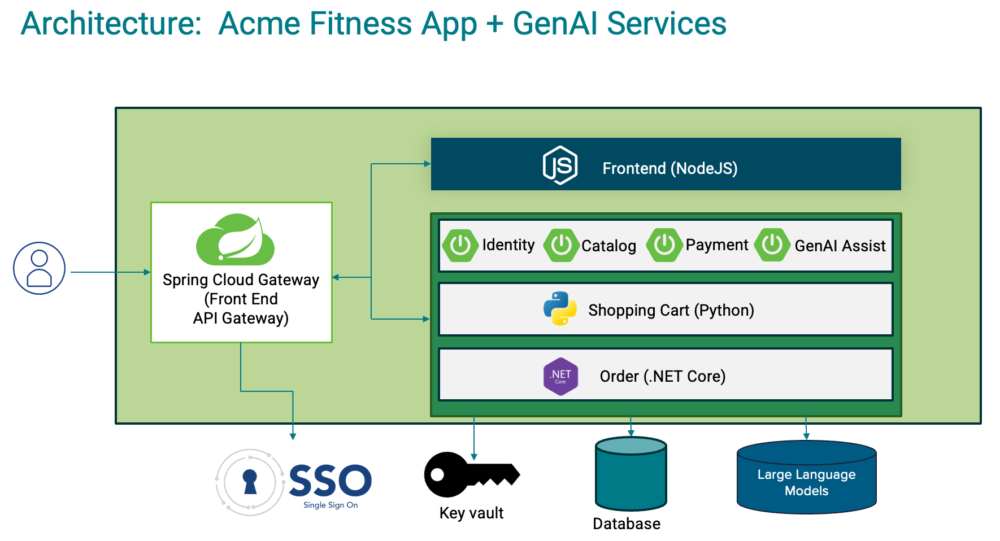

# ACME Fitness Store

ACME Fitness store is a fictional, online sporting goods retail store. This repository contains the source code and
deployment resources for the ACME Fitness store application.

## Architecture



This application is composed of several services:

* 4 Java Spring Boot applications:
    - A catalog service for fetching available products.
    - A payment service for processing and approving payments for users' orders
    - An identity service for referencing the authenticated user
    - An assist service for infusing AI into fitness store

* 1 Python application:
    - A cart service for managing a users' items that have been selected for purchase

* 1 ASP.NET Core applications:
    - An order service for placing orders to buy products that are in the users' carts

* 1 Node.js and static HTML Application
    - A frontend shopping application

The sample can be deployed to Azure Spring Apps Enterprise or Tanzu Platform.

## Repo Organization

| Directory                                 | Purpose                                                                     |
|-------------------------------------------|-----------------------------------------------------------------------------|
| [apps/](./apps)                           | source code for the services                                                |
| [e2e/](./e2e)                             | end to end frontend tests                                                   |
| [local-development/](./local-development) | local docker configuration ([documentation](./local-development/README.md)) |

## Deployment

### Tanzu Platform for Cloud Foundry (tPCF aka TAS)

Assumption that the proper Cloud Foundry CLI has been installed.

#### Create Services

```bash
cf create-service p.redis on-demand-cache acme-redis 
cf create-service postgres on-demand-postgres-db acme-postgres
cf create-service postgres on-demand-postgres-db acme-assist-postgres
cf create-service postgres on-demand-postgres-db acme-order.yml-postgres       

# This sets up your TAS/tPCF config server. It assumes that your config files are located at <this-repository-url> in the branch config (label) under the directory config (searchPaths). You can checkout the branch to see the structure if you like.
cf create-service p.config-server standard acme-config  -c  '{ "git": { "uri": "<this-repository-url>", "label": "config", "searchPaths": "config" } }'

# This assumes Tanzu Single Sign on for TAS/tPCF is installed and configured against UAA.  You can also use other identity providers if you change the plan and binding below.
cf create-service p-identity uaa acme-sso   
cf create-service p.service-registry standard acme-registry  
cf create-service p.gateway standard acme-gateway -c '{"sso": { "plan": "uaa", "scopes": ["openid", "profile", "email"] }, "host": "acme-fitness" ,"cors": { "allowed-origins": [ "*" ] }}'

# This assumes you have a Chat and Embedding model plan configured with GenAI for Tanzu Platform v0.6+
cf create-service genai <CHAT MODEL PLAN> acme-genai-chat
cf create-service genai <EMBED MODEL PLAN> acme-genai-embed
```

#### Identity Service

```bash
cd acme-identity
./gradlew assemble
cf push --no-start
cf bind-service acme-identity acme-registry

# Replace [YOUR APPS DOMAIN] with your TPCF's apps domain for the gateway
cf bind-service acme-identity acme-sso -c '{  "grant_types": ["authorization_code"],
    "scopes": ["openid"],
    "authorities": ["openid"],
    "redirect_uris": ["https://acme-fitness.[YOUR APPS DOMAIN]/"],
    "auto_approved_scopes": ["openid"],
    "identity_providers": ["uaa"],
    "show_on_home_page": false}'
 
cf bind-service acme-identity acme-gateway -c identity-routes.json
cf start acme-identity

```

#### Cart Service

```bash
cd ../acme-cart
cf push --no-start
cf bind-service acme-cart acme-gateway -c cart-routes.json
cf start acme-cart
```

#### Payment Service

```bash
cd ../acme-payment
./gradlew assemble
cf push --no-start
cf bind-service acme-payment acme-gateway -c pay-routes.json
cf start acme-payment
```

#### Catalog Service

```bash
cd ../acme-catalog
./gradlew clean assemble
cf push --no-start
cf bind-service acme-catalog acme-gateway -c catalog-service_rate-limit.json
cf start acme-catalog
```

#### Acme Assist

```bash
cd ../acme-assist
./gradlew clean assemble

# Use this with GenAI 0.6+
cf push --no-start 
cf add-network-policy acme-assist acme-catalog
cf bind-service acme-assist acme-gateway -c assist-routes.json
cf start acme-assist
```

#### Order Service

```bash
cd ../acme-order.yml
dotnet publish -r linux-x64
cf push --no-start
cf add-network-policy acme-order.yml acme-payment
cf bind-service acme-order.yml acme-gateway -c order-routes.json
cf start acme-order.yml
```

#### Shopping Service

```bash
cd ../acme-shopping-react
npm install
npm run build
cf push --no-start
cf bind-service acme-shopping acme-gateway -c frontend-routes.json
cf start acme-shopping
```

> [!NOTE]  
> Ensure that the environment variable for TAS has `SPRING_MVC_STATIC_PATH_PATTERN: /static/images/**` set. Currently,
> there is an issue with the value taken from config server being overwritten.

#### tPCF Development Tricks

##### Connecting to Database

https://docs.cloudfoundry.org/devguide/deploy-apps/ssh-services.html

`cf ssh -L 65432:{host-of-database-on-TAS}:5432 {application-name}`

## Deploy on Tanzu Platform for Kubernetes (tPk8s)

Assume Tanzu Platform has been configured with a project, space, and clusters.

> [!NOTE]  
> These steps are only relevant for deploying `acme-catalog`

1. Install Tanzu CLI ([documentation](https://docs.vmware.com/en/VMware-Tanzu-CLI/1.4/tanzu-cli/index.html))
    ```bash
    brew update
    brew install vmware-tanzu/tanzu/tanzu-cli
    ```

2. Install the Tanzu Platform plugin
   group ([documentation](https://docs.vmware.com/en/VMware-Tanzu-CLI/1.4/tanzu-cli/tanzu-plugin.html#tanzu-plugin-install-8))
    ```bash
    tanzu plugin install --group vmware-tanzu/app-developer
    ```

3. Login to Tanzu Platform and set project / space scope
    ```bash
    tanzu login
    tanzu project use
    tanzu space use
    ```

   > [!TIP]
   > This can be verified using `tanzu context current`
   
4. Build the application using buildpacks and deploy.
    ```bash
    tanzu deploy
    ```